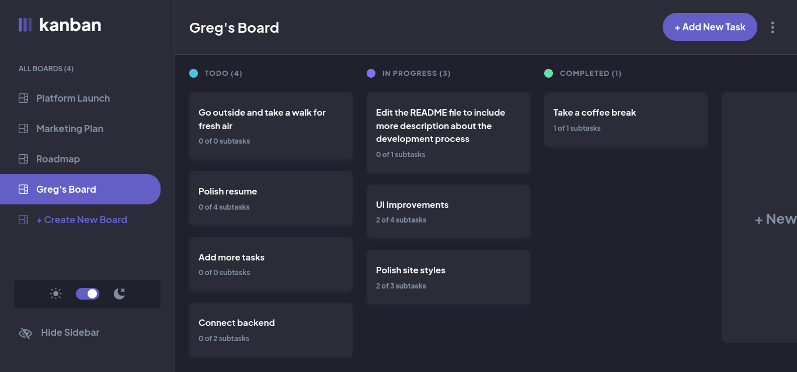

# Frontend Mentor - Kanban task management web app 

## Work in progress

This is my solution to the [Kanban task management web app challenge on Frontend Mentor](https://www.frontendmentor.io/challenges/kanban-task-management-web-app-wgQLt-HlbB).  

## Table of contents

- [Overview](#overview)
  - [Requirements](#requirements)
  - [Screenshot](#screenshot)
  - [Links](#links)
- [My process](#my-process)
  - [Built with](#built-with)
  - [What I learned](#what-i-learned)
  - [Things to add](#things-to-add)
- [Author](#author)

## Overview

### Requirements

Users should be able to:

- View the optimal layout for the app depending on their device's screen size
- See hover states for all interactive elements on the page
- Create, read, update, and delete boards and tasks
- Receive form validations when trying to create/edit boards and tasks
- Mark subtasks as complete and move tasks between columns
- Hide/show the board sidebar
- Toggle the theme between light/dark modes
- **Bonus**: Allow users to drag and drop tasks to change their status and re-order them in a column
- **Bonus**: Keep track of any changes, even after refreshing the browser (`localStorage` could be used for this if you're not building out a full-stack app)
- **Bonus**: Build this project as a full-stack application

### Screenshot

### Links

- Live Site URL: [Kanban Guru](https://kanban-guru.netlify.app/))

## My process

### Built with

- [React](https://reactjs.org/) - JS library
- [TypeScript](https://www.typescriptlang.org/)
- [Redux](https://redux-toolkit.js.org/)
- [Redux](https://redux.js.org/)
- [Redux toolkit](https://redux-toolkit.js.org/)
- [tailwind](https://tailwindcss.com/) - For styles

### What I learned

I learned a lot while building this project! I wanted to take on a challenging project and build it from scratch. I used this project as an opportunity to strengthen some skills:

- I used tailwind for the first time while building this.
- I learned and used Redux for the first time. During the process, I took a break and worked on a small demo app on the side to learn redux and redux toolkit.
- As an added challenge, I used TypeScript, which I had only made smaller projects with before. The more I work with it, the more I like it and the more comfortable I get.
- I was going to use React Context for state, which I had used before, but as I was figuring out how to use it with TypeScript, I thought, this would be the perfect time to learn Redux. So I went ahead and built out the structure and style, then dove into Redux.
- to be continued...

### Things to add
- improve mobile styles
- save to local state
- save to firebase
- consider building a backend for the project

## Author

- Website - [Greg Schoenberg](https://gregschoenberg.com)

